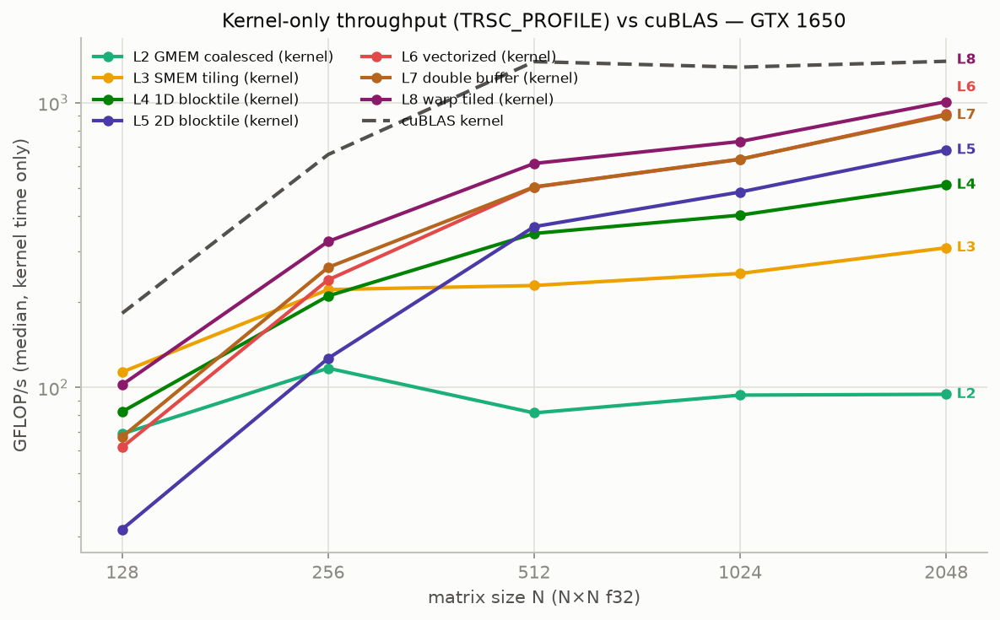

# trsc: A Tiny Rust Compiler

[](https://github.com/shashank1545/trsc/actions/workflows/ci.yml)

`trsc` is a compiler for a subset of Rust, built with C++17, LLVM, and MLIR. It demonstrates modern compiler architecture: a custom AST, semantic analysis (type and borrow checking), and MLIR-based code generation.

## Features

- **Lexer & Parser:** Hand-written recursive descent parser for a Rust-like syntax.
- **Semantic Analysis:**
  - **Symbol Table:** Nested scope management and shadowing support.
  - **Type Checker:** Strong static typing for primitive types and functions.
  - **Borrow Checker:** Initial support for memory safety and ownership rules.
- **MLIR Generation:** Lowers high-level AST constructs into a basic MLIR dialect for further optimization and lowering to LLVM IR.
- **Debugging Tools:** Comprehensive dumping flags for every compiler phase.

## Building the Project

### Prerequisites
- **LLVM & MLIR:** Must be installed and discoverable via CMake (`LLVM_DIR` and `MLIR_DIR`).
- **Clang:** Used as the default C++ compiler.
- **Python:** Required for running `lit` tests.

### Build Steps
```bash
cmake -B build -DLLVM_DIR=/path/to/llvm/lib/cmake/llvm -DMLIR_DIR=/path/to/llvm/lib/cmake/mlir
cmake --build build -j8
```

## Testing

`trsc` is tested at two levels.

### 1. Unit tests (Google Test)
Cover individual C++ components such as the lexer and symbol table.
```bash
cmake --build build --target trsc_unit_tests
./build/test/Unit/trsc_unit_tests
```

### 2. Regression and integration tests (lit + FileCheck, ctest)
Verify compiler output end-to-end (AST, MLIR, generated code). Configure
with `-DENABLE_TESTING=ON` (off by default), then:
```bash
ctest --test-dir build              # add -LE GPU to skip GPU-dependent tests
# or run a lit suite directly
lit -v test/Regression
```

## Usage

Run the `trsc` compiler with various flags to inspect different phases:

```bash
# Dump the AST
./build/tools/trsc/trsc --dump-ast example.rs

# Dump the typed AST (post-sema, with resolved types and scopes)
./build/tools/trsc/trsc --dump-typedast example.rs

# Emit MLIR
./build/tools/trsc/trsc --emit-mlir example.rs

# Inspect the Symbol Table
./build/tools/trsc/trsc --dump-symboltable example.rs

# Tokenize only
./build/tools/trsc/trsc --dump-tokens example.rs
```

## Performance

trsc recognizes matmul loop nests, rewrites them to a `trscd.gemm` op, and
lowers them through a CUDA optimization ladder selected with
`--matmul-opt-level` (1 = naive CPU loops, 2 = coalesced GMEM kernel,
3 = shared-memory tiling, 4 = 1D blocktiling, 5 = 2D blocktiling,
6 = vectorized, 7 = double-buffered SMEM, 8 = warp tiling). Measured on a
GTX 1650 (sm_75), f32 square matmul, against cuBLAS. Kernel-only timings
(CUDA events around each launch) are the fair trsc-vs-cuBLAS comparison —
both operate on device-resident buffers:



| N | L2 | L3 | L4 | L5 | L6 | L7 | L8 | cuBLAS |
|---|---|---|---|---|---|---|---|---|
| 128 | 68.76 | 113.36 | 82.24 | 31.78 | 61.68 | 67.11 | 102.3 | 182.36 |
| 256 | 116.91 | 220.75 | 209.72 | 126.62 | 238.82 | 264.21 | 325.77 | 657.93 |
| 512 | 81.46 | 228.16 | 347.49 | 367.22 | 505.53 | 506.48 | 612.17 | 1394.47 |
| 1024 | 94.06 | 251.55 | 403.06 | 485.91 | 632.73 | 633.85 | 731.18 | 1333.43 |
| 2048 | 94.68 | 309.57 | 514.37 | 681.65 | 911.64 | 904.11 | 1008.83 | 1398.27 |

Kernel-only GFLOP/s, median of 10 reps after 2 warmup calls. The ladder
peaks at **1009 GFLOP/s at N=2048 with L8 warp tiling — 72.2% of cuBLAS
sgemm** (1398 GFLOP/s) on this card.

End-to-end (each rep a full program call: host alloc + init, device
staging, launch, copy-back, sync), staging overhead dominates —
L8 reaches 256 GFLOP/s at N=2048 vs 552 for a hoisted-allocation cuBLAS
loop:


Full data (e2e + kernel series, all levels) in
[bench/results/](bench/results/).

Reproduce with `python3 bench/run_bench.py --all --profile` — see
[bench/README.md](bench/README.md). Measurement details are in
[docs/benchmark-methodology.md](docs/benchmark-methodology.md); analysis
of the results in
[bench/results/findings.md](bench/results/findings.md).

