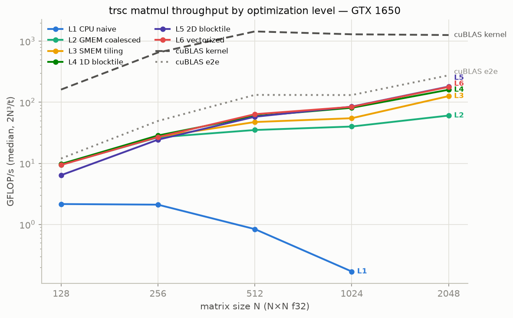
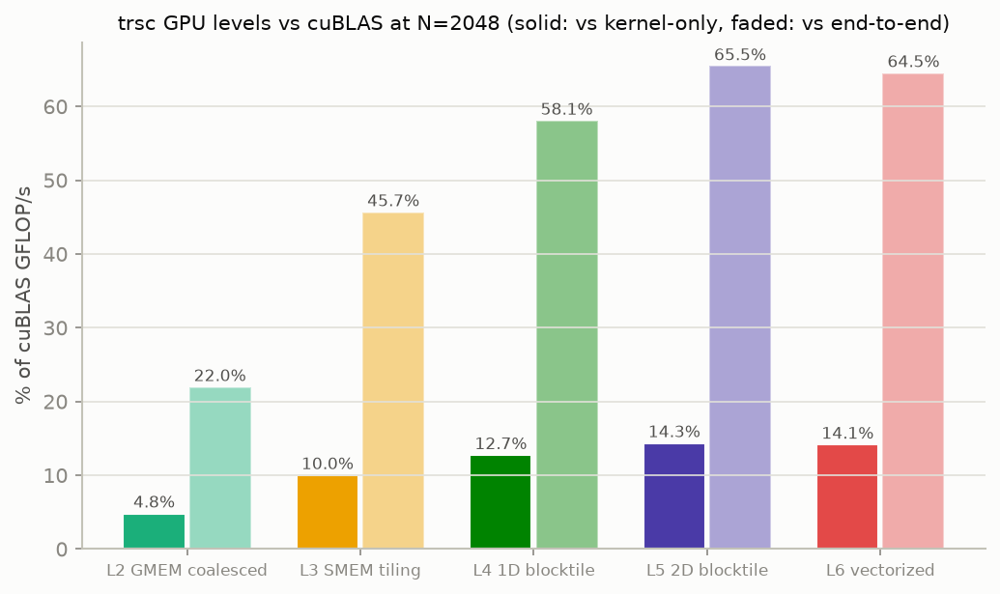

# trsc: A Tiny Rust Compiler

`trsc` is a compiler for the Rust language, built using C++17, LLVM, and MLIR. It is designed to demonstrate modern compiler architecture, including a custom AST, semantic analysis (borrow checking, type checking), and MLIR-based code generation.

##  Features

- **Lexer & Parser:** Hand-written recursive descent parser for a Rust-like syntax.
- **Semantic Analysis:**
  - **Symbol Table:** Nested scope management and shadowing support.
  - **Type Checker:** Strong static typing for primitive types and functions.
  - **Borrow Checker:** Initial support for memory safety and ownership rules.
- **MLIR Generation:** Lowers high-level AST constructs into a basic MLIR dialect for further optimization and lowering to LLVM IR.
- **Debugging Tools:** Comprehensive dumping flags for every compiler phase.

## Building the Project

### Prerequisites
- **LLVM & MLIR:** Must be installed and discoverable via CMake (`LLVM_DIR` and `MLIR_DIR`).
- **Clang:** Used as the default C++ compiler.
- **Python:** Required for running `lit` tests.

### Build Steps
```bash
mkdir build && cd build
cmake .. -DLLVM_DIR=/path/to/llvm/lib/cmake/llvm -DMLIR_DIR=/path/to/llvm/lib/cmake/mlir
make 
```

## Testing Strategy

`trsc` uses a dual-testing approach for maximum reliability. See [test.md](test.md) for more details.

### 1. Unit Testing (Google Test)
Used for testing individual C++ components like the Lexer and Symbol Table.
```bash
make trsc_unit_tests
./test/trsc_unit_tests
```

### 2. Regression Testing (Lit + FileCheck)
Used for end-to-end verification of compiler output (AST, MLIR, etc.).
```bash
make check-trsc
# or
lit -v ../test
```

## Usage

Run the `trsc` compiler with various flags to inspect different phases:

```bash
# Dump the AST
./bin/trsc --dump-ast example.rs

# Dump TypedAST (this is the final ast after the sema containing type and scope info)
./bin/trsc --dump-typedast example.rs

# Emit MLIR
./bin/trsc --emit-mlir example.rs

# Inspect the Symbol Table
./bin/trsc --dump-symboltable example.rs

# Tokenize only
./bin/trsc --dump-tokens example.rs
```

## Performance

trsc recognizes matmul loop nests, rewrites them to a `trscd.gemm` op, and
lowers them through a CUDA optimization ladder selected with
`--matmul-opt-level` (1 = naive CPU loops, 2 = coalesced GMEM kernel,
3 = shared-memory tiling, 4 = 1D blocktiling, 5 = 2D blocktiling,
6 = vectorized). Measured on a GTX 1650 (sm_75), f32 square matmul, against
cuBLAS:





| N | L1 | L2 | L3 | L4 | L5 | L6 | cuBLAS e2e | cuBLAS kernel |
|---|---|---|---|---|---|---|---|---|
| 128 | 2.46 | 1.82 | 5.37 | 4.97 | 2.07 | 2.33 | 11.98 | 190.65 |
| 256 | 2.05 | 2.6 | 19.71 | 20.26 | 4.93 | 5.03 | 57.65 | 645.28 |
| 512 | 0.8 | 2.78 | 33.43 | 36.45 | 8.82 | 8.68 | 135.99 | 1325.61 |
| 1024 | 0.28 | 2.8 | 42.49 | 39.7 | 9.8 | 9.95 | 172.93 | 1333.43 |
| 2048 | — | 2.87 | 45.39 | 39.88 | 11.93 | 11.81 | 342.71 | 1200.26 |

GFLOP/s, median of 10 reps (3 for CPU) after 2 warmup calls; full data
including kernel-only times in [bench/results/](bench/results/).

**Methodology.** Timing is honest end-to-end: each rep is one full program
call — host matrix allocation and initialization, `gpu.host_register`
pinning, kernel launch, and sync — measured with `CLOCK_MONOTONIC`; every
rep verifies the numerical result before its time counts. trsc kernels
operate on pinned host memory (zero-copy over PCIe, ~12 GB/s), while cuBLAS
uses device-resident buffers, so cuBLAS is shown both end-to-end (including
allocation, copies, and sync) and kernel-only. Kernel-only trsc times
(`TRSC_PROFILE=1`, CUDA events around each launch) are in the full results.
GPU clocks are not locked; medians + warmup + per-run clock snapshots
mitigate. Reproduce with `python3 bench/run_bench.py --all --profile` — see
[bench/README.md](bench/README.md).

**Findings.** Shared-memory tiling (L3) is the big jump — 16× over the
coalesced-GMEM kernel (L2) at N=2048, reaching ~13% of cuBLAS kernel
throughput while reading operands over PCIe. The benchmark also exposed a
real regression: the 2D-blocktiling and vectorized lowerings (L5/L6) run
3–4× slower than L3/L4 at every size ≥ 256 (confirmed kernel-only, so it is
kernel code, not launch overhead) — currently under investigation.

